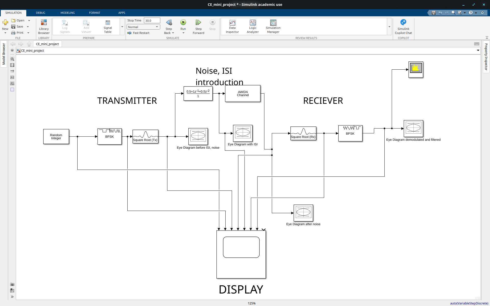
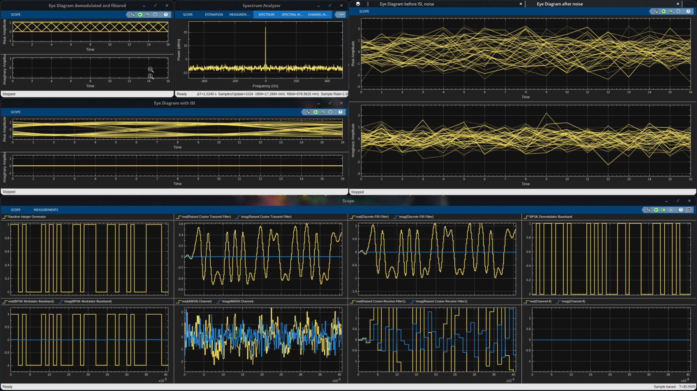

# ISI-Simualtion-In-SIMULINK-MATLAB
A small project to simulate Inter Symbol Interference in Wireless Communications 


# BPSK Communication System with ISI and AWGN

### MATLAB Simulink | Digital Communication | Signal Processing

---

## Overview

This project presents the simulation and analysis of a **BPSK digital communication system** subjected to **Inter-Symbol Interference (ISI)** and **Additive White Gaussian Noise (AWGN)**.

The complete communication chain is implemented in **MATLAB Simulink** and includes transmitter processing, ISI channel modeling, AWGN, receiver processing, eye-diagram analysis, spectrum analysis, and BPSK demodulation.

The simulation is used to visualize the effect of ISI and noise on the transmitted signal and to study the corresponding changes in the eye diagram and received waveform.

---

## Objectives

- Develop a BPSK digital communication system in Simulink.
- Generate a random binary information sequence.
- Perform BPSK modulation.
- Apply pulse shaping at the transmitter.
- Introduce Inter-Symbol Interference using a channel model.
- Introduce Additive White Gaussian Noise.
- Analyze the effect of ISI and noise using eye diagrams.
- Recover the transmitted signal at the receiver.
- Apply receive filtering and BPSK demodulation.
- Analyze the signal spectrum.

---

## System Architecture

The complete communication system consists of a transmitter, channel, receiver, and display/analysis section.

### Communication Flow

**Random Binary Data → BPSK Modulator → Transmit Filter → ISI Channel → AWGN → Receive Filter → BPSK Demodulator → Recovered Data**

---

## Simulink Model

The complete system was implemented in MATLAB Simulink.



---
## Simulation Results

The simulation demonstrates the effects of **Inter-Symbol Interference (ISI)** and **AWGN noise** on a BPSK communication system. The eye diagram shows progressive signal distortion as ISI and noise are introduced, while the receiver filtering and demodulation recover the transmitted signal. The Spectrum Analyzer also shows the frequency-domain characteristics of the transmitted signal.



## Design Methodology

**Binary Data Generation → BPSK Modulation → Pulse Shaping → ISI Introduction → AWGN Channel → Receive Filtering → BPSK Demodulation → Signal Analysis**

---

## Transmitter

The transmitter consists of:

- Random Integer Generator
- BPSK Modulator
- Square Root Raised Cosine Transmit Filter

The random binary sequence is converted into BPSK symbols and pulse-shaped before being transmitted through the modeled communication channel.

---

## ISI Channel

Inter-Symbol Interference is introduced using a channel/filter model in the Simulink system.

The channel response used in the simulation is represented by:

```text
0.5 + 1z⁻¹ + 0.5z⁻²
